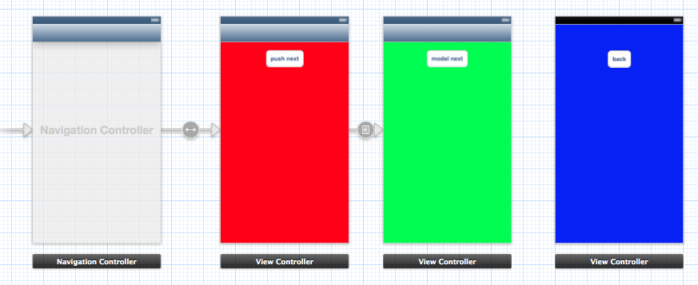
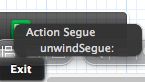

# Unwind Segue学习
在iOS 6(Xcode 4.5)中，UIViewController引入了下面三个函数：

	- (BOOL)canPerformUnwindSegueAction:(SEL)action fromViewController:(UIViewController *)fromViewController withSender:(id)sender
	- (UIViewController *)viewControllerForUnwindSegueAction:(SEL)action fromViewController:(UIViewController *)fromViewController withSender:(id)sender
	- (UIStoryboardSegue *)segueForUnwindingToViewController:(UIViewController *)toViewController fromViewController:(UIViewController *)fromViewController identifier:(NSString *)identifier
	
这三个函数，打开帮助文档一顿猛查之后。发现自己还是云里雾里。一夜的辗转反侧之后终于有眉目了。请客官继续往下看。

## Unwind Segue是什么
通读上面的3个函数之后，我们发现最关键的两个词是“Unwind Segue”。字面意思是“解开segue”。我们就拿UINavgationController来说。导航视图控制器可以通过push操作来增加子视图控制器，也可以通过pop来弹出视图控制器。增加视图控制器我们也可以通过segue来操作。那么相对于segue来说弹出视图控制器，我们使用什么呢？没错，就是unwind segue。我们可以使用unwind segue来弹出导航控制器的视图；关闭popover；dismissed模态视图控制器；通过你定制的方式关闭视图控制器。通过unwind segue不仅可以转换到前一个视图控制器，甚至可以跳过中间一系列的视图控制器直接转换到前面的某一个视图控制器。

## 实战

1. 新建一个工程UnwindSegue
2. 新建一个导航控制器，三个子视图控制器(红－>绿使用push segue; 绿->蓝使用代码弹出模态视图控制器)
3. 分别建立RedViewController, GreenViewController, BlueViewController
4. 在storyboard中设置好视图控制器的具体类;并给BlueViewController设置Storyboard ID为BlueViewController
5. 在GreenViewController.m中拖出onModalBtnClicked:的IBAction
6. 在onModalBtnClicked:实现弹出BlueViewController的代码
7. 在RedViewController中实现- (IBAction)unwindSegue:(UIStoryboardSegue *)sender;
8. 在BlueViewCOntroller中选中按钮，按住control拖动到底部的EXIT上，松开鼠标，选中unwindSegue: 
9. 运行程序看一下吧。

## 小结

1. 需要在目标视图控制器中实现 - (IBAction)unwindSegue:(UIStoryboardSegue *)sender; IB中才能将按钮拖拽到Exit上面去。
2. 在 - (IBAction)unwindSegue:(UIStoryboardSegue *)sender; 中通过segue可以取得源视图控制器，以便满足一些特别的需求。（例如根据不同的来源显示不同的内容。这个和preparSegue:有些类似）
3. unwind segue是减少控制器。 segue是增加控制器。
4. unwind segue的执行顺序：
	1. 目标控视图控制器的容器会调用 segueForUnwindingToViewController:fromViewController:identifier: 来创建一个segue
	2. 在目标控视图控制器执行unwindSegue:
	3. 执行segue

	